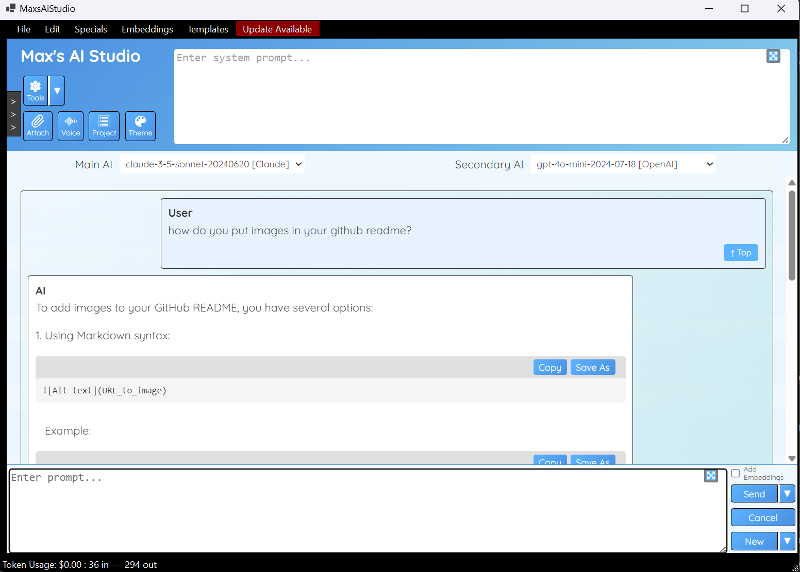
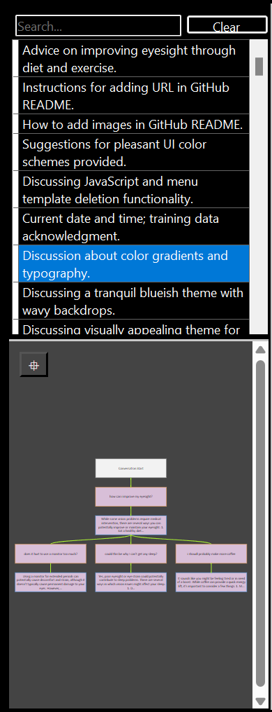
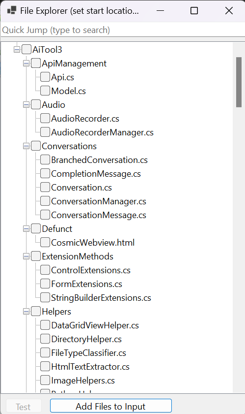
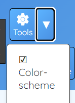
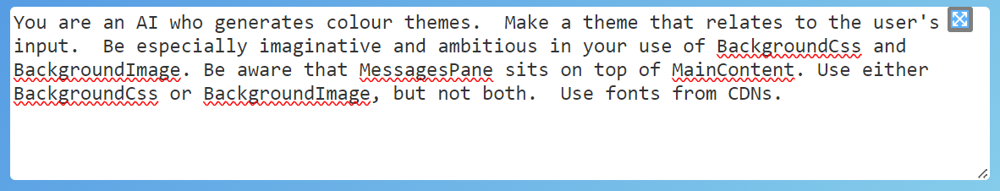
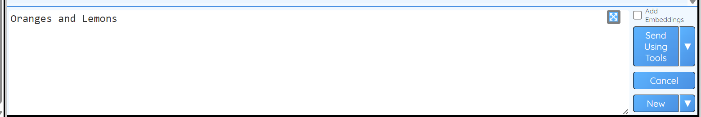
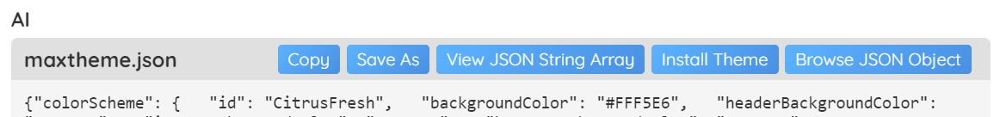
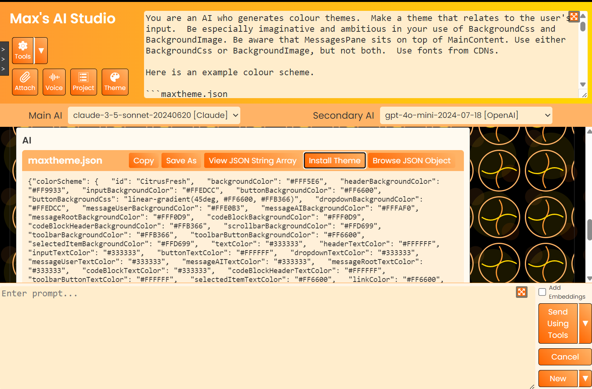
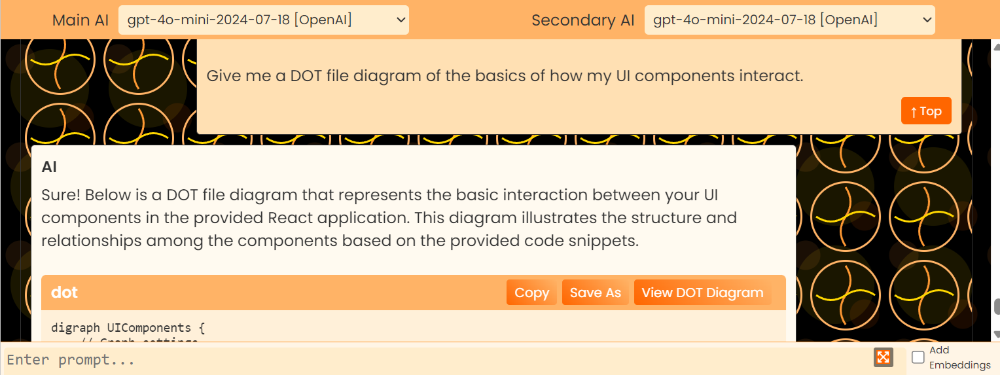
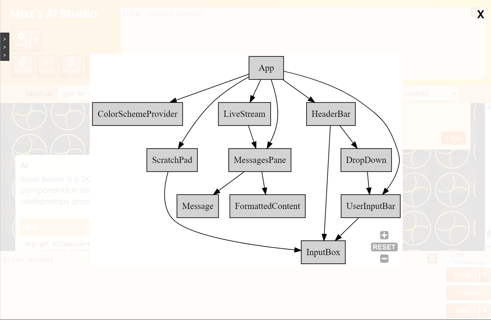

# Max's AI Studio

An open-source Windows C# AI chat application which works with Anthropic Claude, OpenAI ChatGPT, Groq, Google Gemini, and Ollama-hosted models.  It includes many features including conversation management, templating, embeddings retrieval and more.

# Pre-requisites

For OpenAI, Anthropic, Groq or Gemini, you will need an API key.  Enter it in Edit -> Settings or on first run.

For local AI via Ollama, you will need to install https://ollama.com/download/windows and one or more models.

For media transcription, you will need to install https://github.com/m-bain/whisperX .  You can configure the Conda activate.bat path in Edit -> Settings.

For media transcription *and* live transcription, you willl need https://developer.download.nvidia.com/compute/cuda/redist/libcublas/windows-x86_64/
 - extract the three files to the install folder.  You will also need to copy them into whisperX, likely to the path C:\Users\<username>\miniconda3\envs\whisperx\bin
 
# UI

There are three main areas: the header bar, which includes the current System Prompt; the messages pane, where the chat takes place; and the user bar, where user input takes place.

Enter a chat message and click Send; your message and the response will be added to the chat.  Streaming can be turned on or off in Settings.

Note that two AIs are specified.  The main AI is used for normal chat, the secondary AI is used for everything else (except embeddings).

Use the sidebar to revisit and continue previous conversations and messages.  Right-click for options in the Conversations list and the Messages diagram.  Conversations are automatically summarised using the secondary AI.

# Additional features

You can attach an image from file, image from the clipboard (if there is one), multiple text files, or a video/audio file.  Video/audio files are automatically transcribed to the input box.

The Voice button will begin live transcription using Whisper, directly into the input box.  This is... experimental.

The Project button will show a project browser, so you can easily copy files into the input box.  The root of the project browser, and the filetypes it displays, can be set in Edit -> Settings.

The Theme button allows you to select a Theme.  See Tools below.

# Tools

1) Colour Scheme Generator

Turn on the Color Scheme tool:

Give an appropriate System Prompt:

And an appropriate User Prompt:

Install the resulting theme:

2) A Find-and-replace tool is available which commands the AI to specify its response in terms of finds-and-replaces.  These can be Selected, and then Applied to a previous code block.

# Extensions

Extensions are included to:
 * Launch HTML in WebView (try "give me complete HTML/JS that draws the Mandelbrot set")
 * view JSON (try "demonstrate python recursion in tree-drawing")
 * view DOT (GraphViz) diagram files
 * view Mermaid diagram files
 * view PlantUML diagrams (patchy, with external website dependency)
 * view SVG files (used to generate the icons for this application)
 * launch Python scripts (at the time of writing this may or may not be working)
 * launch Powershell scripts
 * save to file
 * copy to clipboard
 
 Amongst many others, these extensions can be used for easy diagramming:
 
 
 
 
  
# Embeddings

This section is to be expanded, but:

1) Create an embeddings file using Embeddings -> Create Embeddings... .  Only a few filetypes are supported for now (visible in the dialogs).

2) Select the embeddings file using Embeddings -> Select Embeddings... .

3) Turn on "Add Embeddings".  When you send a message, the system will derive embeddings and present them in a list, where you can select which (if any) should be included.

Embeddings can currently only be created via local (Ollama) installs, for instance mxbai-embed-large .  Note that the model name can be configured in Settings.

# Other points of interest

Pressing CTRL-Return in the input box, will Send the current message.  Pressing CTRL-SHIFT-Return will do the same, using the secondary AI.

Token costs can be entered into the Settings dialog, and are correct at the time of writing.  Interaction costs appear in the status bar at the bottom of the window; accumulated costs are accessible via Specials -> Show Model Usage/Cost Statistics.

You can edit the raw content of a message by right-clicking in the messages diagram.

In theory at least, any OpenAI-compatible API, including that offered by Ollama, should work if you set the Protocol to "OpenAI" in the Settings form.

# Known issues

No Base64 image support for Groq
No token counting for Groq
Tools only for Claude and OpenAI protocols (incl Ollama-via-OpenAI-protocol)