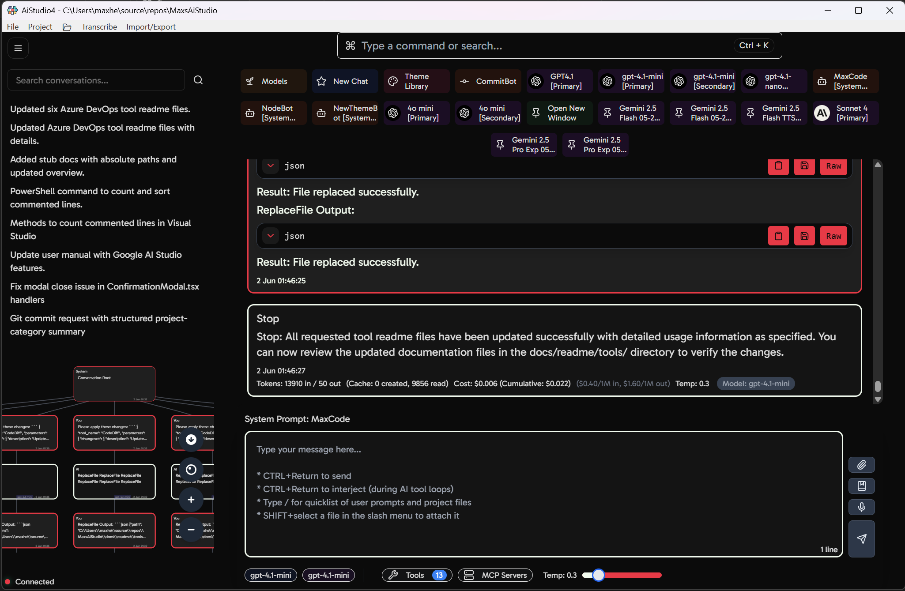

# Max's AI Studio 4 - User Guide

**A Windows Desktop AI (LLM) Command Centre for Enhanced Development & Productivity.**

## Overview

Max's AI Studio 4 (AiStudio4) is a feature-rich desktop application engineered to serve as a comprehensive AI-powered workspace for software developers, power users, and anyone looking to harness the capabilities of modern AI models. It provides a unified interface for interacting with various Large Language Models (LLMs), an extensible tool ecosystem, and deep integration with local development projects.

## Quick Start

1. **Set Project Path**: Go to `File > Project > Set Project Path...` and select your project root directory
2. **Configure AI Providers**: Use `Ctrl+K` → "Service Providers" to add your API keys
3. **Add AI Models**: Navigate to Settings → Models to configure your preferred AI models
4. **Start Chatting**: Begin conversing with AI using the input bar at the bottom

## Documentation

This user guide is organized into the following sections:

### Core Documentation
- **[Introduction](docs/readme/01-introduction.md)** - What is AiStudio4, who it's for, and key highlights
- **[Getting Started](docs/readme/02-getting-started.md)** - System requirements, installation, and initial setup
- **[Core Concepts](docs/readme/03-core-concepts.md)** - Understanding the main interface, project path, AI models, tools, and conversations

### User Guide
- **[Using AiStudio4](docs/readme/04-using-aistudio4.md)** - Chatting with AI, managing conversations, working with prompts, using tools, and attachments
- **[Key Features in Detail](docs/readme/05-key-features-in-detail.md)** - AI model integration, tool system, UI customization, project integration, and backend functionality
- **[Advanced Configuration](docs/readme/06-advanced-configuration.md)** - Backend settings, user-specific configurations, and API key management

### Reference
- **[Troubleshooting](docs/readme/07-troubleshooting.md)** - Common issues and solutions
- **[Technical Stack](docs/readme/08-technical-stack.md)** - Technologies and frameworks used
- **[Contributing](docs/readme/09-contributing.md)** - How to contribute and development notes
- **[License](docs/readme/10-license.md)** - Licensing information
- **[Author & Acknowledgements](docs/readme/11-author-acknowledgements.md)** - Credits and acknowledgements
- **[Further Reading & Links](docs/readme/12-further-reading-links.md)** - Additional resources and external links
- **[Changelog](docs/readme/CHANGELOG.md)** - Recent changes and version history

## Key Features

- **Unified AI Chat** with OpenAI, Anthropic Claude, Google Gemini, and MCP servers
- **Powerful Tool Ecosystem** for file operations, web tasks, and developer integrations
- **Deep Project Integration** with context-aware AI assistance
- **Advanced Conversation Management** with branched history and tree visualization
- **Extensible & Customizable** with custom tools and AI-powered theming
- **Real-time Interaction** with streaming responses and tool interjection
- **Modern Desktop Experience** built with .NET 9 and React

## Quick Links

- [Installation Guide](docs/readme/02-getting-started.md#22-installation)
- [Tool System Overview](docs/readme/05-key-features-in-detail.md#52-tool-system)
- [Theming Guide](docs/readme/05-key-features-in-detail.md#531-theming)
- [Troubleshooting](docs/readme/07-troubleshooting.md)

---

*For the complete user guide, please refer to the individual documentation sections linked above.*